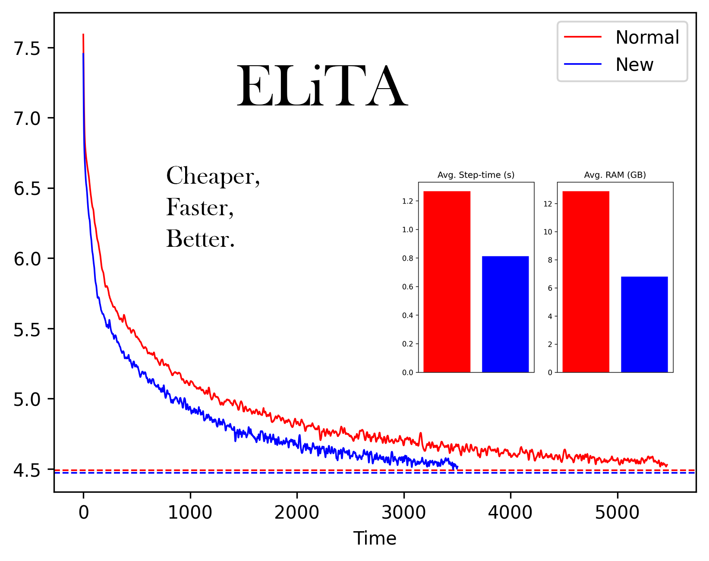

# elita-transformer

**Disclaimer: This project is in early stages, but due to a lack of time and resources, may not continue further. Please take this research into your own hands and cite this page if you do. This was done by an individual on free Colab runtimes, who would very much appreciate your generosity.**

<a href="https://www.buymeacoffee.com/acos"></a>

Official Repository for Efficient Time-Linear-Attention Transformers. Implementation in Tensorflow2.
This is a re-working of both the Attention and Feed-Forward elements of a Transformer, resulting in faster and cheaper computation while keeping performance the same, if not in fact better. Principally, Attention is truly time-linear in sequence length with absolutely no cost to performace, and the heavy $d_{\text{linear}}=4d_{\text{model}}$ being replaced on the up-scale with a much lighter implementation.



The above results are **premilinary**, on wikiText with models of sizes of <300K params, sequence-length 256 and batch-size 128, using SentencePiece and Adam(min(1e-3, 1e-2/sqrt(step), 0.9, 0.99). In that test, they were trained over a single epoch, and the test returned from the normal Transformer was lower than the improved one by 0.02, as shown by the dotted lines on the train-loss curves above. However, the model has shown good performance on **sequence-lengths of 100K+** on the Red-Pajama dataset an model sizes of 10M+.

A full paper will hopefully be released at some point. Base code is available on this repo.

# Intuition
The goal is to make Transformers cheaper, so that more powerful LLMs can be developped with less reliance on masses of A100s and TPUv4 pods. Though perhaps it is a long way from that, scaling to much larger sequence lengths should be considerably easier.

## Attention
The attention mechanism manages to be time-linear by using cumulative sums, which though not original, is used in a new way. (This means it is Decoder-only.) Like in original attention, there is a (never used fully) square array of logits which are softmaxed across rows and summed with values, but here, instead of the logit being $Q(x_i)^\top K(x_j)$, it is $K(x_j)\cdot P(i, j)$, where the key transformation $K$ is now to a scalar, as is the positional information $P$. On top of this, if $i=j$, there is an additional, (seperate parameter) key transformation added.

To get a grasp on the generality of this mechanism, picture this. Take a trainable (N, N) matrix, whose entries are $P(i, j)$ (really $c^{\top}(p_{1,j}+p_{2,i})$ ), and sum to it the similarity of $x_j$ with a trainable vector of the same dimension every row, and the same across the diagonal with a different trainable vector. Then, perform standard softmax across rows, and use this as an (N, N) weight. 

## FeedForward
The feed-forward magic works by splitting the dimensions of the down-scale kernel into the model width and linear scale factor, and summing across each of them with seperate inputs. These inputs replace the up-scale, and are simple linear layers with swish on top of sizes width and linear scale factor. More clearly, it is an einsum(i,j,ijk->k), using the two inputs i and j, and the full-size kernel ijk. We use a scale factor of 8 to account for the loss of generality, but this does not have a negative impact as described below.

The reasoning is that LLMs use the up-scale as a memory search and the down-scale as memory storage. Instead of simply approximating the double linear transformation, (with activation in-between), I am making that memory search more efficient; literally, across and along instead of just along.

## True Softmax
The equation for $y_i$ under Attention2 is a true softmax operation. It takes the sum of the first $i$ softmax weights, multiplied by the corresponding $V$ value. The exponentiated logits for row $i$ are $e^{k_2^{\top}x_i},e^{p_{2,i}^{\top}c}X_0,e^{p_{2,i}^{\top}c}X_1,\cdots,e^{p_{2,i}^{\top}c}X_i$. All the values here, including $X$, are $e$ raised to the something. Taking their sum multiplied each time by a corresponding $V$, then dividing by the sum of the unchanged sequence, this is a nomral softmax.

## Note on Parameters
If you keep all the model dimensions same (as was done with above wikitext experiment), and layers, heads, etc, there will be a small (~5%) increase in parameter count due to the scale of 8, which is (I find) a good value for this to work, but the parameters saved in attention (as Q and K kernels no longer exist, really) should make up for this.

# Equations
**Attention2**

Inputs: $x\in\mathbb{R}^{n\times d_1}$

Parameters: $k_i\in\mathbb{R}^{d_1}$, $a_i, b_i, c\in\mathbb{R}^{d_2}$, $V\in\mathbb{R}^{d_3\times d_1}$

Output: $y\in\mathbb{R}^{n\times d_3}$

$$p_{1,i}=\sin(ia_1n^{-1}+b_1)$$

$$p_{2,i}=\sin(ia_2n^{-1}+b_2)$$

$$X_i=e^{k_1^\top x_i+p_{1,i}^\top c}$$

$$y_i=(e^{k_2^\top x_i}Vx_i+e^{p_{2,i}^\top c}\sum_j^iX_jVx_j)(e^{k_2^\top x_i}+e^{p_{2,i}^\top c}\sum_j^iX_j)^{-1}$$

**FeedForward2**

Inputs: $x\in\mathbb{R}^{d}$

Parameters: $W_1\in\mathbb{R}^{d\times d},W_2\in\mathbb{R}^{d\times 8},W_3\in\mathbb{R}^{d\times d\times 8},b_1\in\mathbb{R}^d,b_2\in\mathbb{R}^8,b_3\in\mathbb{R}^d$

Output: $y\in\mathbb{R}^{d}$

$$\sigma(x)=x(e^{-x}+1)^{-1}$$

$$y=W_3\sigma(W_1x + b_1)\sigma(W_2x + b_2)^\top + b_3$$

# Cite
```
{
  name:Efficient Time-Linear-Attention Transformers,
  author:ACO Sharma
  date: 08/2023
}
```
